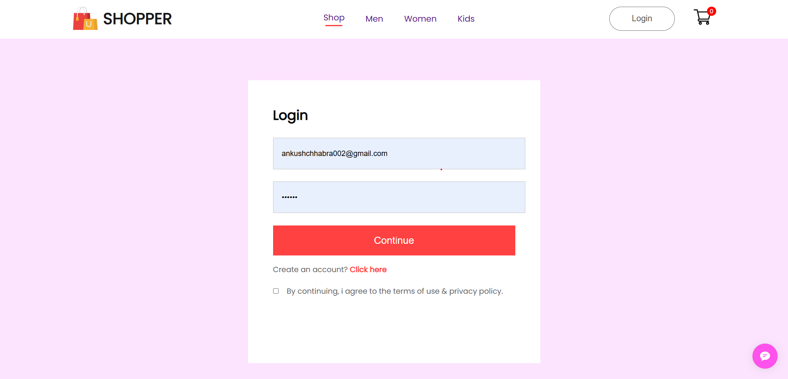
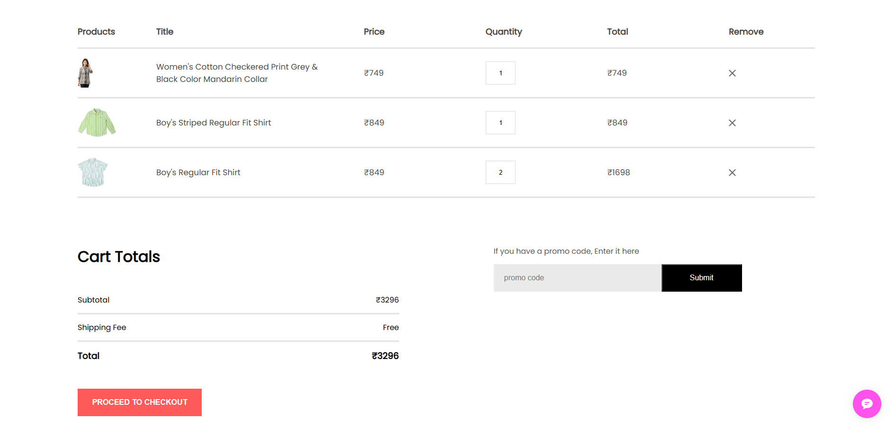

# E-Commerce Website

This is a fully functional **E-Commerce Website** built using **React.js** for the frontend, **Express.js** for the backend, and **MongoDB** for the database. It provides users with a seamless shopping experience, including product browsing, cart management.

## Features

- **User Authentication**: Secure login and signup system.
- **Product Management**: List, view, and filter products.
- **Shopping Cart**: Add/remove products, update quantities.
- **Order Management**: Track orders, view history.
- **Admin Panel**: Manage products, orders, and users.

## Tech Stack

- **Frontend**: React.js, ContextAPI
- **Backend**: Express.js, Node.js
- **Database**: MongoDB (MongoDB Atlas)

## Demo

Here’s a preview of the E-Commerce Website in action:

1. Home Page
   

2. Login Page
   

3. Cart Page
   
